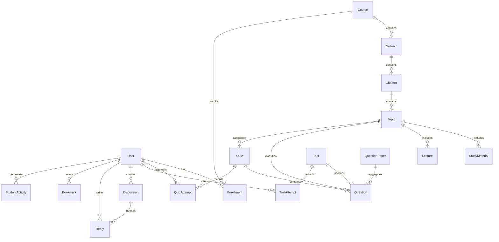

# EduPlatform — System Architecture & Design Document

## 1. Executive Summary

**EduPlatform** is a modern, full-stack digital education and computer-based examination preparation platform built on the **MERN** stack (MongoDB, Express.js, React.js, Node.js) with **Tailwind CSS**. It combines the structured curriculum of a Learning Management System (LMS), the rigorous assessment capabilities of a competitive exam test series (CBT engine), a rich academic community/forum, and an intelligent AI study assistance layer.

---

## 2. High-Level Architecture Diagram

```
+-------------------------------------------------------------------------------+
|                                CLIENT LAYER                                   |
|   React 18 (Vite SPA) + Tailwind CSS + Recharts + React Router v6 + Axios     |
|                                                                               |
|  [Student Hub]     [Classroom / LMS]    [CBT Exam Engine]    [Admin Suite]    |
|  - Dashboard       - Course Syllabus    - Fullscreen CBT     - User & RBAC    |
|  - Analytics       - PDF / PPT Reader   - Auto-Save Timer    - Question Bank  |
|  - Leaderboard     - Lecture Player     - Palette Navigator  - Course Builder |
|  - Discussions     - Quizzes & Drills   - Score & Analytics  - Test Manager   |
+---------------------------------------+---------------------------------------+
                                        | (HTTPS / REST JSON + Bearer JWT)
                                        v
+-------------------------------------------------------------------------------+
|                            API GATEWAY & MIDDLEWARE                           |
|   Express.js Application Router + Helmet + CORS + Morgan + Cookie Parser      |
|                                                                               |
|  [Auth Guard]      [RBAC & Permissions] [Multer Upload]  [Global Error Handler]|
|  - JWT verify      - Role Validator     - 100MB disk      - Custom ErrorResponse|
|  - Req.user bind   - Resource x Action  - File type check - Mongoose sanitizer  |
+---------------------------------------+---------------------------------------+
                                        |
                                        v
+-------------------------------------------------------------------------------+
|                           BACKEND CONTROLLER DOMAINS                          |
|                                                                               |
| [Auth & Users]   [Curriculum]       [Assessments]     [Community & Analytics] |
| - Register/Login - Courses          - Questions Bank  - Discussions & Replies |
| - Password Reset - Subjects/Topics  - Quizzes (Auto)  - Interactive Polls     |
| - Profile & RBAC - Materials/Videos - CBT Exams (CBT) - Student & Admin Dash  |
+---------------------------------------+---------------------------------------+
                                        |
                                        v
+-------------------------------------------------------------------------------+
|                             DATA PERSISTENCE LAYER                            |
|                 MongoDB 7+ (Mongoose ODM with Schemas & Indexes)               |
|                                                                               |
|  - Users & Roles     - Questions & Papers   - Test/Quiz Attempts (Logs)       |
|  - Courses/Taxonomy  - Materials & Lectures - Activity Timeline & Bookmarks   |
+---------------------------------------+---------------------------------------+
```

---

## 3. Database Schema & Entity Relationships

The platform utilizes 21 specialized Mongoose schemas:



### Key Models & Technical Properties

| Model | Primary Purpose | Key Indexes & Properties |
|---|---|---|
| **User** | Authentication, Profile, RBAC & Badges | `email` (unique), `role` (enum), `studyStreak`, `permissions` |
| **Course** | Root container for curriculum | `slug` (unique), `instructor` (ref), `category`, `status` |
| **Subject / Chapter / Topic** | 3-tier hierarchical syllabus taxonomy | `course`, `subject`, `chapter` refs, `order` integer |
| **StudyMaterial** | Documents (PDF, PPT, Doc, Notes) | `fileUrl`, `fileSize`, `aiSummary`, `keyPoints`, `tags` |
| **Lecture** | Video lectures with timeline notes | `videoUrl`, `duration`, `notes`, `aiSummary`, `order` |
| **LectureProgress** | Video resume and completion tracking | `{ user, lecture }` (compound unique), `>=90%` marks completed |
| **Question** | Atomic question bank | `type` (MCQ/MSQ/Numerical), `difficulty`, `stats`, `solutionHtml` |
| **QuestionPaper** | Previous Year Papers & Mock Papers | `exam`, `year`, `questions` array, `totalMarks`, `duration` |
| **Quiz** | Micro-assessments & topic drills | `shuffleQuestions`, `showAnswers` rule, `quizType` |
| **QuizAttempt** | Quiz submissions & auto-grading | `answers` array with correctness, `score`, `accuracy` |
| **Test** | Multi-section CBT mock examinations | `sections` array, `negativeMarkingRule`, `duration` |
| **TestAttempt** | Real-time CBT exam telemetry | `visited`, `markedForReview`, `rank`, `percentile`, `timeTaken` |
| **Discussion & Reply** | Academic peer & educator forum | `upvotes`, `isAnswered`, `isInstructorReply`, `isMarkedHelpful` |
| **Poll** | Interactive voting & sentiment | `options.votes` array, `expiresAt`, `totalVotes` |
| **Enrollment** | Student course progression | `{ user, course }` (compound unique), `completedTopics` |
| **StudentActivity** | Chronological telemetry log | `{ user, timestamp }` index, `activityType`, `duration` |

---

## 4. Security & Role-Based Access Control (RBAC)

### 4.1 Granular Roles Matrix

| Role | Access Scope | Description |
|---|---|---|
| **superadmin** | `*.*` | Total platform governance, role assignment, system configuration |
| **admin** | Platform-wide | Content management, user moderation, analytics, test series |
| **content_manager** | Courses & Materials | Authoring curriculum, uploading media, reviewing submissions |
| **instructor** | Course / Student Scope | Lecture delivery, doubt clearance, quiz creation, student tracking |
| **question_manager**| Question Bank | Question entry, bulk CSV import, taxonomy tagging, solutions |
| **reviewer** | Quality Assurance | Proofing questions, reviewing draft courses and test papers |
| **moderator** | Community & Forums | Discussion moderation, reported posts, poll management |
| **student** | Learning & Examination | Course enrollment, video player, quizzes, CBT tests, forums |

### 4.2 Security Implementations
- **Authentication**: Stateless JSON Web Tokens (JWT) signed with SHA-256 secret key, stored in `localStorage` / HTTP-only cookies with configurable expiry (`30d`).
- **Password Protection**: Salting and hashing via `bcryptjs` (cost factor 10).
- **Helmet**: Secures HTTP headers (XSS filter, anti-clickjacking, CSP, MIME-sniffing prevention).
- **Rate Limiting**: `express-rate-limit` prevents brute-force login attempts (100 requests per 15-minute window per IP).
- **File Upload Security**: Strict MIME-type filtering in Multer disk storage, preventing executable script uploads.

---

## 5. CBT (Computer-Based Test) Examination Engine

The CBT module faithfully reproduces national and international competitive computer-based testing interfaces:

```
+-----------------------------------------------------------------------------------+
|  [Test Title]               Section: [ Physics | Chemistry | Math ]   Time: 02:44:12  |
+-------------------------------------------------------------+---------------------+
|                                                             | QUESTION PALETTE    |
|  Question 14 of 30                          Marks: +4 / -1  |  [01] [02] [03] [04]|
|                                                             |  [05] [06] [07] [08]|
|  A particle executes simple harmonic motion with amplitude  |  [09] [10] [11] [12]|
|  A and angular frequency omega. At what displacement is its |  [13] >14< [15] [16]|
|  kinetic energy equal to its potential energy?              |                     |
|                                                             | LEGEND:             |
|  (A) x = A / 2                                              | [G] 12 Answered     |
|  (B) x = A / sqrt(2)     [x Selected]                       | [R]  4 Unanswered   |
|  (C) x = A * sqrt(3) / 2                                    | [P]  2 Marked Review|
|  (D) x = A                                                  | [W]  1 Ans & Marked |
|                                                             | [.] 11 Not Visited  |
|  [ ] Mark for Review & Next                                 |                     |
|                                                             +---------------------+
|  [ < Previous ]    [ Clear Choice ]    [ Save & Next > ]    | [  Submit Test  ]   |
+-------------------------------------------------------------+---------------------+
```

### CBT Engine Features:
1. **Multi-Section Switcher**: Seamless navigation across test sections with dedicated question banks and marks allocations.
2. **5-State Question Palette**:
   - `Gray`: Not visited
   - `Red`: Visited but unanswered
   - `Green`: Answered and saved
   - `Purple`: Marked for review without answering
   - `Purple with Green dot`: Answered and marked for review (counted in scoring)
3. **Auto-Save Telemetry**: Asynchronous debounced background auto-save every 30 seconds via `PUT /api/tests/:id/answer`.
4. **Auto-Submission**: High-precision countdown timer triggers automated test submission upon expiry.
5. **Instant Analytics & Cohort Percentile**:
   - Total score and negative marking deductions computed in server controller.
   - Cohort percentile calculated dynamically against all test submissions.
   - Section-wise, difficulty-wise, and time-allocation graphs rendered using Recharts.

---

## 6. AI Layer Architecture (Scaffolded & Extensible)

```
[Student Context / Document / Lecture] 
                 |
                 v
     +-----------------------+
     |   AI Engine Adapter   |  <--->  [Google Gemini API / OpenAI]
     +-----------------------+
                 |
  +--------------+--------------+--------------+
  |                             |              |
  v                             v              v
[Document Summary]     [Diagnostic Quiz Gen]  [Study Assistant]
- Bullet Key Points    - Instant 5-MCQ Drill  - Weak Topic Reminders
- Flashcards Flip Deck - Explanation on Error - Next Action Recommender
```

- **Material & Lecture Summaries**: Automated key concept extraction and downloadable flashcards.
- **Rule-Based & AI Recommendations**: Evaluates past 5 test/quiz attempts; generates targeted revision recommendations for topics with accuracy below 60%.

---

## 7. Frontend UI / UX Architecture

- **SPA Router**: React Router v6 with `React.lazy` and `Suspense` for performance-optimized chunk loading.
- **Responsive Layout**: Mobile-first Tailwind design system with collapsible sidebar drawer, persistent navigation, and dark mode toggles.
- **Unified Component Library**: Reusable Atoms (`Button`, `Badge`, `Avatar`, `ProgressBar`), Molecules (`StatCard`, `SearchBar`, `FilterPanel`, `Pagination`), and Organisms (`Table`, `Modal`, `RichTextEditor`, `CBTExamCanvas`).
- **Data Visualization**: Recharts integration for line trend charts, radar subject mastery charts, and horizontal poll vote tallies.
